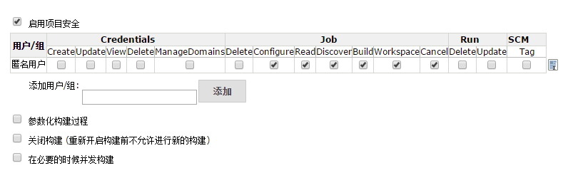
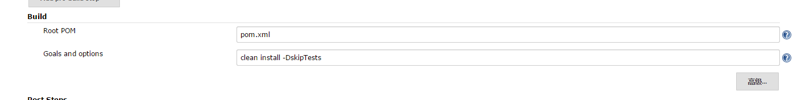
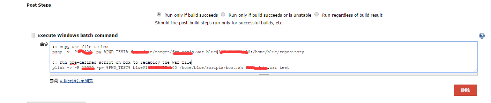
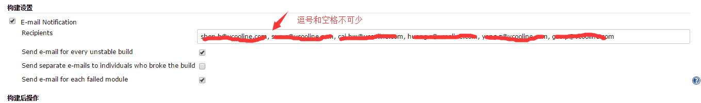

# 安装和使用jenkins
## 准备
官方的已经很详细了

[官网](http://jenkins-ci.org/)

[官方安装教程](https://wiki.jenkins-ci.org/display/JENKINS/Use+Jenkins)

[官方启动安装教程](https://wiki.jenkins-ci.org/display/JENKINS/Starting+and+Accessing+Jenkins)


## 总结
```
sudo java -jar /usr/lib/jenkins/jenkins.war --httpPort=8083
```
jenkins 实际上是在内部嵌入了jetty容器，通过jar 的方式直接发布的，所以我们可以直接用jar命令直接运行war包就好了

用yum安装jenkins，会默认将jenkins的war包放在/usr/lib/jenkins下面

配置放在/etc/sysconfig/jenkins下

启动脚本为/etc/init.d/jenkins

JENKINS_HOME="/var/lib/jenkins"

## 使用




### 设置

```
#!/bin/bash

export REPOSITORY=/home/$USER/repository
export LOG_FILE=/home/$USER/logs/`date +"%F"`.log

if [[ -f $REPOSITORY/$1 ]]
then
  cd /home/$USER/scripts
  sh .boot $REPOSITORY $1 $2 >>$LOG_FILE 2>&1
fi
```
